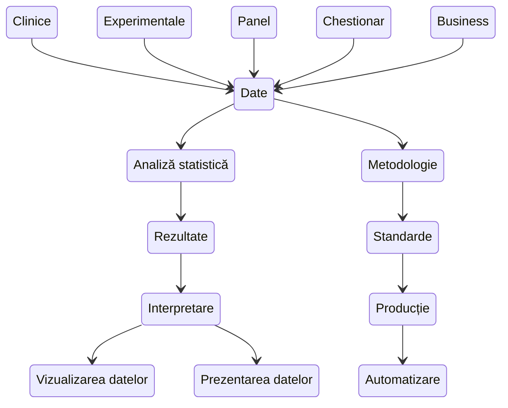

---
# Use the Intro widget of the Blog template
widget: about.avatar

# This file represents a page section.
headless: true
diagram: true
mermaid: true
# Order that this section will appear in.
weight: 10

author: admin
#design:
#  background:
#    color: '#090a0b'
#    text_color_light: true
#    video:
#      path:  # enter filename of a video in /assets/media
#  css_class: fullscreen

---

<h2 style="text-align: left;">
Salut, eu sunt Virgil.
</h2>

Sunt statistician și sunt specializat în analiză statistică aplicată, cercetare academică și data science. Pe scurt, pot prelucra orice tip de date și pot extrage cele mai relevante rezultate, astfel încât să poți publica o lucrare academică, să iei o decizie bazată pe date sau să creezi un MVP. 

Deoarece niciun proiect nu este la fel, iar seturile de date diferă (cu mici excepții) combin statistica cu limbaje de programare precum R, Python, JavaScript ș.a pentru a oferi cât mai multă flexibilitate. Fie că vorbim de biostatistică, date clinice sau experimentale, anchete statistice, vizualizarea datelor sau business analysis, cel mai important este să poți comunica corect și eficient rezultatele. 

 

