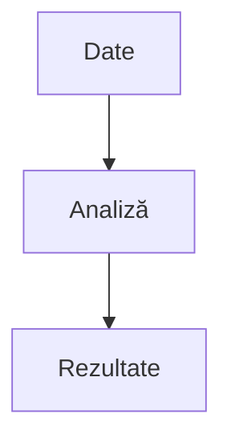
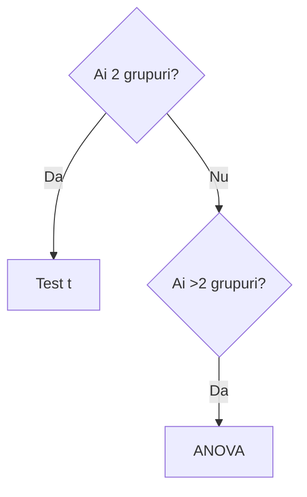

## Definește obiectivele și ipotezele analizei tale

Primul pas într-o analiză statistică corectă constă în formularea clară a obiectivelor și a ipotezelor de cercetare. Fără această etapă, analiza riscă să devină o simplă explorare a datelor, fără direcție metodologică. Obiectivele trebuie să răspundă la întrebări concrete, precum identificarea diferențelor între grupuri sau evaluarea relațiilor dintre variabile.

Ipotezele sunt formulate în mod standard sub forma ipotezei nule și a ipotezei alternative. De exemplu, ipoteza nulă presupune absența unei relații sau diferențe, în timp ce ipoteza alternativă sugerează existența acesteia. Alegerea corectă a ipotezelor influențează direct selecția testelor statistice și interpretarea rezultatelor.

## Stabilește de tipuri de date și variabile vei utiliza

În această etapă este esențial să identifici natura variabilelor utilizate în analiză. Variabilele pot fi nominale, ordinale sau de tip scală (interval/raport), iar fiecare tip implică metode statistice diferite.

De asemenea, trebuie să stabilești relația dintre variabile, respectiv care sunt variabile independente și care sunt variabile dependente. Această clasificare este crucială pentru alegerea testului statistic adecvat și pentru interpretarea corectă a rezultatelor.


## Pregătește și codifică variabilele

Datele brute necesită, de regulă, un proces de curățare și codificare înainte de analiză. Acest proces implică eliminarea valorilor lipsă sau anormale, verificarea consistenței datelor și transformarea variabilelor în formate utilizabile în software-ul statistic.

Codificarea variabilelor presupune atribuirea unor valori numerice pentru răspunsuri categorice. De exemplu, variabilele de tip „da/nu” pot fi codificate ca 1 și 0. O structurare corectă a bazei de date reduce semnificativ riscul de erori în etapele ulterioare.


## Rulează o analiză descriptivă pentru a putea stabili testele inferențiale

Analiza descriptivă oferă o imagine de ansamblu asupra datelor și reprezintă un pas esențial înainte de aplicarea testelor inferențiale. Aceasta include calcularea mediei, deviației standard, frecvențelor și distribuțiilor.

Pe baza acestor rezultate, poți observa tendințele generale și eventualele anomalii. De asemenea, analiza descriptivă ajută la identificarea tipului de distribuție a datelor, ceea ce influențează alegerea testelor statistice ulterioare.


## Testează normalitatea datelor

Testarea normalității este o etapă critică în analiza statistică, deoarece multe teste inferențiale presupun distribuția normală a datelor. Printre cele mai utilizate teste se numără Shapiro-Wilk și Kolmogorov-Smirnov.

Pe lângă testele statistice, este recomandată și utilizarea metodelor grafice, cum ar fi histogramele sau Q-Q plots. Dacă datele nu respectă distribuția normală, trebuie utilizate teste neparametrice sau metode alternative.


## Alege testul statistic corect pentru ipotezele tale

Alegerea testului statistic depinde de mai mulți factori: tipul variabilelor, numărul de grupuri și distribuția datelor. De exemplu, testul t este utilizat pentru compararea a două grupuri, în timp ce ANOVA este utilizată pentru mai multe grupuri.

Pentru relații între variabile se pot utiliza corelații sau regresii, iar pentru date categoriale, testul chi-pătrat. Selectarea corectă a testului este esențială pentru validitatea concluziilor.


## Alege un software pe care să poți rula analiza ta


Software-ul statistic joacă un rol important în eficiența și acuratețea analizei. Printre cele mai utilizate opțiuni se numără JASP, SPSS, R și Excel.

JASP este intuitiv și potrivit pentru utilizatori începători, în timp ce SPSS oferă funcționalități extinse pentru analize complexe. Alegerea software-ului depinde de nivelul de experiență și de complexitatea analizei.


## Interpretează rezultatele 

Interpretarea rezultatelor reprezintă una dintre cele mai importante etape ale analizei. Aceasta implică evaluarea valorilor p, a coeficienților și a intervalelor de încredere.

Rezultatele trebuie interpretate în contextul ipotezelor inițiale și al obiectivelor cercetării. Este important să se evite interpretările eronate, cum ar fi confundarea semnificației statistice cu relevanța practică.


## Vizualizează datele relevante din analiza ta

Vizualizarea datelor facilitează înțelegerea și comunicarea rezultatelor. Graficele precum boxplot-urile, scatterplot-urile sau graficele de tip bară sunt frecvent utilizate pentru a evidenția diferențele și relațiile dintre variabile.

O reprezentare vizuală clară poate evidenția tendințe care nu sunt imediat vizibile în tabelele numerice și contribuie la o interpretare mai intuitivă a datelor.


## Rapoartează rezultatele în formatul potrivit 

Ultima etapă constă în prezentarea rezultatelor într-un format adecvat scopului analizei. În mediul academic, raportarea se face conform standardelor APA, incluzând valorile statistice relevante și descrieri clare.

Pentru proiectele aplicate, raportarea poate include explicații simplificate, grafice și concluzii orientate spre decizie. Alegerea formatului potrivit depinde de publicul țintă și de obiectivele analizei.



Informație importantă despre analiză.



Recomandare practică pentru rezultate mai bune.



Atenție la interpretarea p-value.







**Rezultatul este semnificativ statistic (p < .05).**

Rezultatul este semnificativ[^1]

[^1]: p < 0.05 indică semnificație statistică

- analiză descriptivă  
- testare ipoteze  
- interpretare rezultate  

```bash
npm install
```

---

# 🧩 9. Toggle / collapsible (foarte „pro”)

### HTML (merge în Hugo)


<details>
  <summary>Vezi interpretarea rezultatului</summary>

  Rezultatul indică o diferență semnificativă între grupuri.

</details>


| Test        | Când îl folosești |
|------------|------------------|
| Test t     | 2 grupuri        |
| ANOVA      | 3+ grupuri       |


$$
Y = \beta_0 + \beta_1 X + \epsilon
$$

</br>


## Ai nevoie de analiză statistică?

👉 Contactează-mă pentru o evaluare gratuită

</br>

<span style="background:#e6f0ff;padding:4px 8px;border-radius:6px;">
SPSS / JASP
</span>

</br>


<div style="background:#f5f7fa;padding:15px;border-left:4px solid #007bff;">
<strong>Pro tip:</strong> Folosește ANOVA doar dacă ai >2 grupuri.
</div>

</br>


<iframe width="100%" height="400"
src="https://www.youtube.com/embed/VIDEO_ID">
</iframe>

</br>

</br>



Greșeală frecventă: interpretarea greșită a p-value.


</br>

</br>

## Întrebări frecvente

### Ce test statistic să folosesc?
Depinde de tipul datelor.

### Ce este p-value?
Probabilitatea de eroare.